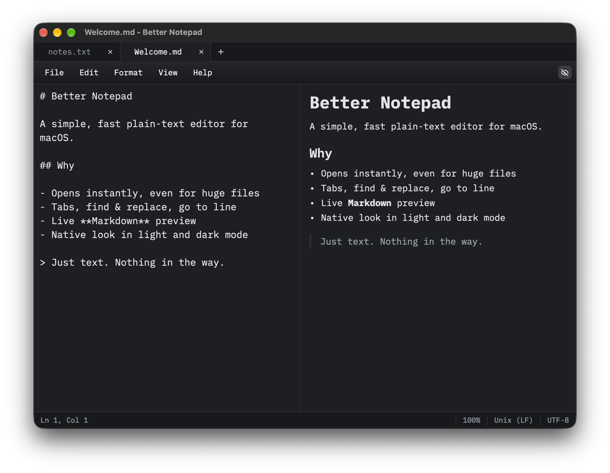

# Better Notepad

A simple, fast plain-text editor for macOS.



## Features

- **Tabs and windows** — Cmd+T for a new tab, Ctrl+Tab to switch, Cmd+W to close; drop a file on the window to open it
- **Session restore** — tabs, windows, and unsaved text come back when you reopen the app
- **Markdown** — live preview beside the editor, plus a `/` slash menu for quick headings, lists, and more
- **Export** — save any tab as PDF or DOCX (Markdown is rendered like the preview)
- **Find and replace** — Cmd+F and Cmd+H, F3 for the next match
- **Go to line** (Cmd+G) and **insert time/date** (F5)
- **Word wrap and status bar** — the status bar shows line, column, zoom, line endings, and encoding
- **Fonts and zoom** — choose the font family and size, and zoom with Cmd+= / Cmd+- / Cmd+0
- **Theming** — Light, Dark, or follow the system, with customization options

## Structure

- [`app/`](app) — the macOS app (Rust, [gpui-kit](https://github.com/longbridge/gpui-kit))
- [`site/`](site) — project website and Sparkle update feed (Astro, deployed to GitHub Pages)

## Development

```sh
cd app
cargo run
```

```sh
cd site
npm install && npm run dev
```

## Credits

Built with [GPUI Kit](https://gpui.rs/), developed by Longbridge and licensed under Apache-2.0.

GPUI Kit is built on [GPUI](https://www.gpui.rs/), the UI framework from Zed Industries, also licensed under Apache-2.0.
